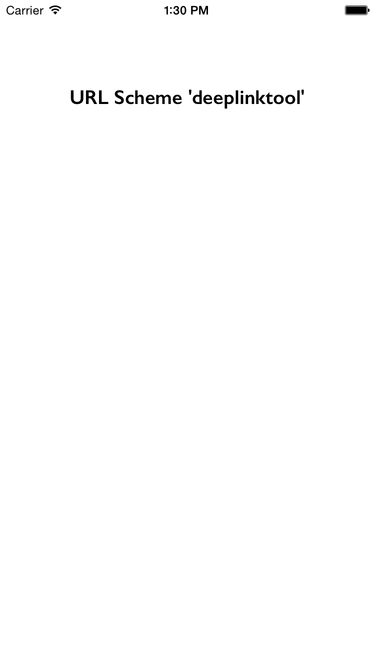
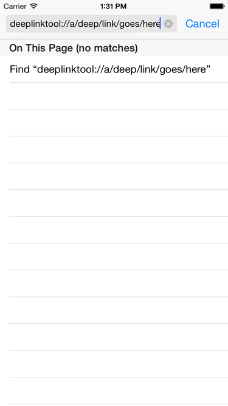
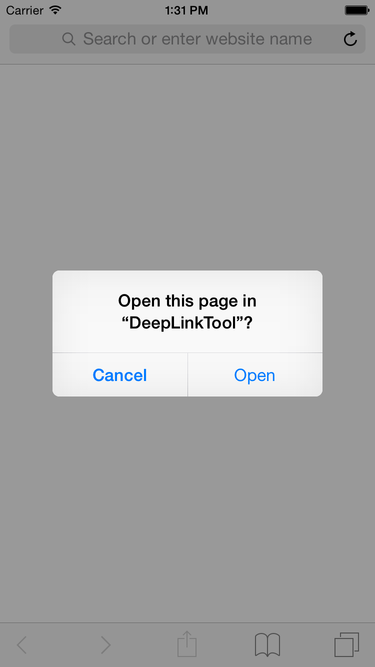
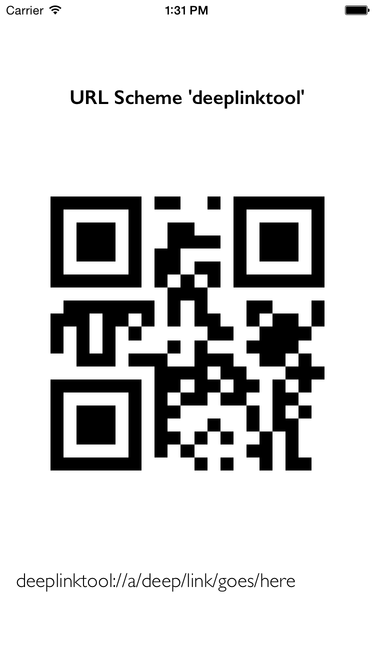

# Synopsis

This app is for testing deep linking. When it starts it will display its URL Scheme for reference. To use, load up Safari and go to something like `<URL Scheme>://a/deep/link/goes/here`. This will switch away from Safari and back to this app. Upon switching back to this app three things occur:

1. Copies the deep link to the device paste board.
2. Shows the deep link in plain text.
3. Displays the deep link as a QR code.

# Example

## Start Screen

## Safari

## Deep Link Triggered

